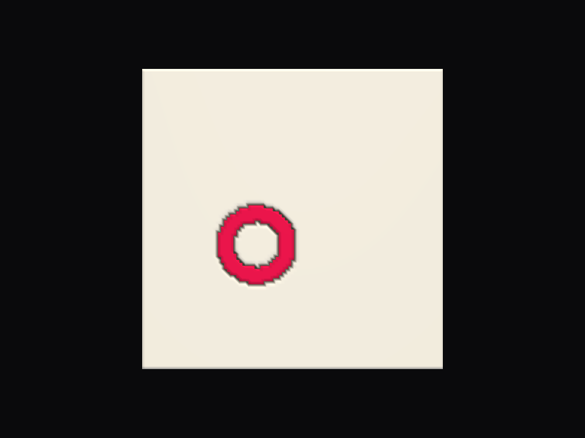

# LithoShape3D

LithoShape3D est un logiciel de création d'objets 3D imprimables à partir
d'images, avec pour cœur historique la génération de lithophanies :

Image → réglages visuels → aperçu → modèle imprimable → export

Le projet évolue vers un outil plus large : lithophanies, reliefs, formes
personnalisées, masques, zones, matériaux, aperçu rétro-éclairé et premiers
caissons LightBox.

## État rapide du projet

- **Lithophanie classique** : fonction mature et fiable, pipeline principal
  du projet.
- **Shape Composer** : génération dans des formes non rectangulaires
  (cercle, cœur, étoile, texte, SVG/image rasterisée) avec trous internes
  préservés.
- **Zones et masques** : composition de plusieurs zones, masques manuels et
  segmentation IA locale sur macOS.
- **Matériaux / couleurs** : séparation du relief, de la composition et du
  matériau pour éviter qu'une couleur modifie involontairement la géométrie.
- **Export** : STL et 3MF multi-objets/multi-matériaux.
- **Windows** : build et smoke test headless vérifiés par GitHub Actions.
- **LightBox Designer** : première brique core/CLI pour générer un caisson
  de texte simple ou de silhouette image/SVG, avec capot plat ou façade
  lithophanie séparée.
- **Backlight Insert** : prototype expérimental, conservé dans le code mais
  non considéré comme validé physiquement.

**Version actuelle : 0.7.2.** Ce README couvre l'installation et l'usage de
base. Pour la vision produit, l'état réel détaillé fonction par fonction,
la roadmap et les décisions techniques, voir `docs/` :

- [`docs/versions/CURRENT_STATE.md`](docs/versions/CURRENT_STATE.md) —
  état réel à jour (version, tests, plateformes testées, statut de chaque
  fonction). Point d'entrée pour reprendre le projet.
- [`docs/MANUAL_FR.md`](docs/MANUAL_FR.md) / [`docs/MANUAL_EN.md`](docs/MANUAL_EN.md) —
  manuel utilisateur complet (toutes les fonctionnalités, expliquées
  simplement), en français et en anglais.
- [`docs/00_PRODUCT_BIBLE.md`](docs/00_PRODUCT_BIBLE.md) — vision produit.
- [`docs/01_ROADMAP.md`](docs/01_ROADMAP.md) — trajectoire vers la 1.0.
- [`docs/07_ARCHITECTURE.md`](docs/07_ARCHITECTURE.md) — architecture
  technique réelle du dépôt.
- [`docs/03_DECISIONS.md`](docs/03_DECISIONS.md) — pourquoi les grandes
  décisions techniques ont été prises.

Les sections ci-dessous décrivent l'installation et documentent l'historique
des phases de développement ; elles ne sont pas mises à jour à chaque
version — se référer à `docs/` pour l'état courant.

## LithoFusion 3D

Évolution visée du projet : combiner lithophanie, relief 3D, formes
personnalisées, couleurs et multi-matériaux (impression multi-couleurs / AMS)
au sein d'une même scène composée de plusieurs zones.

## Architecture

- `core/` — moteur (image, geometry, scene, export, validation). Ne dépend
  jamais de Qt, PyVista, PyVistaQt ou VTK. Utilisable en headless, en CLI ou
  depuis les tests.
- `ai/` — segmentation/assistance IA locale (vide pour l'instant).
- `viewer/` — conversion mesh -> PyVista et gestion de scène (caméra,
  éclairage, vues), indépendante de Qt.
- `ui/` — application PySide6 (`MainWindow`, worker de génération, état,
  logging). Assemble `core` et `viewer`, ne réimplémente jamais leur logique.
- `cli.py` — point d'entrée unique : `lithoshape3d` (sans argument) lance
  l'application graphique. Les commandes `generate`, `lightbox-text` et
  `lightbox-shape` restent utilisables en CLI.
- `tests/` — tests du `core`, du `viewer` et de l'`ui`.

## Installation développement

```bash
python3 -m venv .venv
source .venv/bin/activate
pip install -e ".[viewer,ui,dev]"
```

Installation minimale (core seul, sans interface ni viewer) :

```bash
pip install -e .
```

## Lancer les tests

```bash
pytest
```

## Utilisation (CLI headless, sans interface graphique)

### Lithophanie simple

```bash
lithoshape3d generate photo.png sortie.stl --width 100 --min-thickness 0.8 --max-thickness 3.0
```

`--height` est optionnel : déduite du ratio de l'image si omise. Le mesh est
validé (fermé, manifold, sans triangle dégénéré) avant d'être écrit sur
disque ; la commande échoue explicitement si la validation échoue.

### Benchmark opacité LithoLab

Une commande headless génère le coupon de test LithoLab V1 pour mesurer la
transmission lumineuse d'un filament imprimé avec un LithoMeter :

```bash
lithoshape3d opacity-coupon LithoLab_Opacity_Coupon_V1.stl
```

Le coupon contient 7 zones d'épaisseur :

`0.6 / 0.8 / 1.0 / 1.5 / 2.0 / 2.5 / 3.0 mm`

Ce STL ne dépend d'aucune image source. Il sert de benchmark reproductible
pour comparer des filaments, réglages, buses ou machines dans le protocole
LithoLab.

### LightBox texte + façade lithophanie

La commande `lightbox-text` génère les premières pièces d'un caisson
LightBox à partir d'un texte et d'une image de lithophanie. Cette brique
est un socle headless pour le futur module LightBox Designer ; elle est
utile pour valider l'architecture core avant l'interface complète.

```bash
lithoshape3d lightbox-text photo.png sortie_lightbox \
  --text O \
  --width 70 \
  --height 45 \
  --depth 25 \
  --wall-thickness 5 \
  --resolution 2.5
```

Elle écrit par défaut deux STL dans le dossier de sortie :

- `lightbox_body.stl` — corps creux du caisson avec fond intégré ;
- `lightbox_face.stl` — façade lithophanie ;

Le fond séparé n'est pas le flux produit retenu. Il reste disponible
uniquement sur demande explicite avec `--separate-back-panel`, surtout pour
des tests ou variantes futures.

Cette brique réutilise le pipeline lithophanie fiable et le Shape Composer.
Elle ne dépend pas du prototype Backlight Insert. Les textes complexes,
lettres très fines et logos détaillés nécessitent encore des validations
géométriques et physiques avant d'être considérés comme un flux produit.

### LightBox depuis silhouette image ou SVG

La commande `lightbox-shape` utilise directement une silhouette PNG/JPG/BMP
ou un SVG comme forme du caisson. Par défaut, elle génère un caisson avec
capot plat :

```bash
lithoshape3d lightbox-shape logo.svg sortie_lightbox \
  --width 120 \
  --height 80 \
  --depth 30 \
  --wall-thickness 3
```

Pour générer une façade lithophanie à la forme du SVG :

```bash
lithoshape3d lightbox-shape logo.svg sortie_lightbox \
  --width 120 \
  --height 80 \
  --depth 30 \
  --wall-thickness 3 \
  --face lithophane \
  --lithophane-image photo.png
```

Note : l'import SVG direct réutilise le rasteriseur QtSvg existant dans
l'application. Il nécessite donc une installation avec l'extra UI/app
(`pip install -e ".[app]"`). Sans QtSvg, il faut rasteriser le SVG en PNG
avant d'utiliser la commande.

Dans l'application (menu **Outils > LightBox depuis image...**), le
caisson généré peut aussi recevoir une découpe pour un connecteur
d'alimentation (USB-C ou pogo pin, presets ou dimensions personnalisées)
dans son fond, pour alimenter des LED internes.

## Benchmark

```bash
python scripts/benchmark_mesh.py
```

## Viewer 3D (démo Phase 1B, conservée pour référence)

```bash
pip install -e ".[app]"
python scripts/demo_viewer.py
```

Petite démo minimale ayant servi à valider le viewer avant l'application
complète ci-dessous.

> Remarque macOS : ne pas forcer `QT_QPA_PLATFORM=offscreen` avec PyVistaQt
> — VTK plante (segfault) avec ce backend sur macOS. Lancer normalement
> (fenêtre Qt réelle). Un `pv.Plotter(off_screen=True)` sans Qt fonctionne
> très bien en revanche (utilisé par tous les tests automatisés).

## LithoShape3D 0.1 — application complète

```bash
pip install -e ".[app]"
lithoshape3d
```

(`lithoshape3d` sans argument lance l'application ; `lithoshape3d generate ...`
reste disponible pour l'usage headless en CLI.)

Workflow : Ouvrir image → régler les paramètres (largeur, épaisseur
min/max, résolution, inversion, contraste, luminosité, presets Standard/
Fine/Draft) → Générer → manipuler le résultat en 3D (rotation/zoom/pan, vues
Face/Iso/Reset caméra, modes surface/fil de fer/surface+arêtes) → Exporter
STL. La génération se fait dans un thread séparé (`QThreadPool`), l'interface
reste réactive pendant ce temps. Si un paramètre est modifié après une
génération, le mesh affiché est marqué périmé et l'export est désactivé tant
qu'une nouvelle génération n'a pas été lancée. Les logs sont écrits dans
`~/Library/Logs/LithoShape3D/lithoshape3d.log`.

## Zones et masques (Phase 2A)

Une image peut désormais être découpée en plusieurs zones indépendantes
(panneau "Zones" sous l'aperçu source) : création/suppression/renommage
inline/visibilité/réordonnancement par glisser-déposer. Chaque zone possède
son propre masque (peint via "Éditer le masque..." — pinceau, gomme, taille,
remplir, effacer, inverser, undo/redo ⌘Z/⇧⌘Z) et ses propres paramètres
géométriques. La zone active est mise en surbrillance dans l'aperçu 2D
(overlay coloré, une teinte par zone, l'image source n'est jamais modifiée).

Ouvrir une image crée automatiquement une zone "Lithophanie" à masque plein
(comportement historique préservé). La génération/le viewer 3D ciblent la
zone active — y compris désormais un masque réellement irrégulier (voir
Phase 2B ci-dessous).

Menu Fichier : Nouveau projet / Ouvrir projet.../ Enregistrer / Enregistrer
sous... — un projet est un bundle-dossier `MonProjet.l3dproj/` (image copiée
dans `source/`, masques dans `masks/`, `project.json`), entièrement
déplaçable (aucun chemin absolu enregistré).

## Géométrie d'une zone masquée (Phase 2B)

`build_slab_mesh` épouse désormais la forme réelle du masque d'une zone,
plutôt que de se limiter à la plaque rectangulaire complète : contour
extérieur, trous internes (ex. anneau) et îlots multiples disjoints sont
tous gérés nativement (grille régulière + extraction vectorisée des arêtes
de frontière actif/inactif — voir `core/geometry/mesh_builder.py`). Un
masque plein (ou `mask=None`) reproduit exactement le comportement
historique (aucune régression). Un masque insuffisant (zone trop petite/
fine) est refusé proprement au lieu de produire un mesh corrompu. Les
coordonnées XY restent toujours celles de la Scene complète — pas de
recentrage/rescale automatique sur le contour du masque, condition
nécessaire à la fusion multi-zones de la Phase 2C.

```bash
python scripts/benchmark_masked_mesh.py
```

## Composition multi-zones — LithoFusion (Phase 2C)

Plusieurs zones peuvent maintenant être combinées en un seul objet
imprimable. Chaque zone a un **rôle** (panneau "Rôle de la zone") :

- `ReliefMode` (Lithophanie / Relief-amplitude / Solide) — comment la zone
  transforme son image en hauteur.
- `CompositionMode` (Base / Ajouter / Remplacer) — comment cette
  contribution s'intègre au résultat déjà composé. `Base` et `Remplacer`
  écrasent la hauteur dans leur masque, `Ajouter` s'y additionne.

Composition séquentielle selon l'ordre `Scene.zones` (le glisser-déposer du
panneau Zones a donc maintenant un effet géométrique réel), entièrement par
champ de hauteur NumPy — aucun booléen `manifold3d` entre zones, réservé à
la validation finale et aux futurs volumes non planaires. Le dos reste
toujours à `Z=0` : une contribution ne peut jamais "flotter", au pire elle
forme une composante connexe supplémentaire posée sur le même plateau.

Dans l'affichage, bascule "Zone active / Composition" détermine ce que
`Générer` produit ; l'export STL exporte toujours le résultat actuellement
affiché.

```bash
python scripts/benchmark_composition.py
```

## Backlight couleur (aperçu 3D)

Mode d'affichage dédié (`Affichage > Backlight couleur`) pour estimer le
rendu final d'une pièce Backlight Insert avant impression : combine dans
la même scène le corps blanc rétro-éclairé (même simulation de luminosité
par épaisseur que l'aperçu rétro-éclairé classique) et le ou les inserts
dans leur **vraie couleur matériau**, en vue depuis l'arrière (côté source
de lumière) — les supports sacrificiels ne sont jamais affichés dans ce
mode. Sans zone Backlight Insert active, l'app retombe proprement sur
l'aperçu rétro-éclairé normal.



## Identité visuelle et packaging

Le logo (`src/lithoshape3d/ui/assets/lithoshape3d_mark.svg`) est chargé via
`src/lithoshape3d/ui/branding.py`, utilisé comme icône de fenêtre et comme
logo dans le panneau gauche de l'application. Les icônes natives macOS/
Windows (`packaging/icons/lithoshape3d.icns` / `.ico`) sont régénérées
depuis ce même SVG par `python packaging/generate_icons.py` (nécessite
l'extra `pip install -e ".[packaging]"`) et référencées directement dans
`packaging/lithoshape3d.spec` / `packaging/lithoshape3d_windows.spec`.

Depuis la 0.5.0, l'application a une identité graphique dédiée ("Carbone +
Lumière + Prisme") : thème sombre par défaut, thème clair au choix
(menu **Thème**, préférence mémorisée), accents partagés entre les deux
(`src/lithoshape3d/ui/theme.py`).

## Licence

Certaines fonctionnalités (l'export STL/3MF) nécessitent une licence
valide. Le reste du logiciel (import, cadrage, zones, aperçu 3D) reste
utilisable librement. Menu **Aide > Licence...** pour saisir la clé reçue
à l'achat.

## Langue

Depuis la 0.6.0, l'interface peut s'afficher en anglais (menu **Langue**,
préférence mémorisée, s'applique au prochain lancement). Le français reste
la langue source du code ; les traductions vivent dans
`src/lithoshape3d/ui/translations/` — voir le
[`README`](src/lithoshape3d/ui/translations/README.md) de ce dossier pour
les régénérer après une modification de texte. Couverture actuelle :
fenêtre principale, "À propos", licence — les dialogues plus profonds
(cadrage, éditeur de masque, LightBox) restent en français pour l'instant.

## Découper une pièce à la silhouette d'un sujet

Bouton **Retirer le fond > Utiliser le détourage comme forme...** : détoure
automatiquement le sujet et découpe directement la pièce à sa silhouette
(sans le rectangle de fond), en un clic — raccourci équivalent à faire
Retirer le fond puis Forme > Image avec le résultat, sans le passage
manuel par un fichier intermédiaire.

## État actuel

Cette section historique s'arrêtait à la Phase 2C ; depuis, le projet a
ajouté la segmentation IA (SAM2, macOS uniquement), les formes non
rectangulaires (Shape Composer), les matériaux/couleurs et l'export 3MF
multi-objets, et une stratégie couleur qui garantit qu'assigner un
matériau ne modifie jamais la géométrie (Material Only) ainsi qu'un
prototype expérimental d'insert rétro-éclairé indépendant (Backlight
Insert), ainsi qu'une première brique LightBox texte/silhouette/SVG avec
capot plat ou façade lithophanie.
**Voir [`docs/versions/CURRENT_STATE.md`](docs/versions/CURRENT_STATE.md)
pour l'état réel, fonction par fonction, à jour à chaque version** — ce
README n'est plus le document de référence pour l'état du produit.
